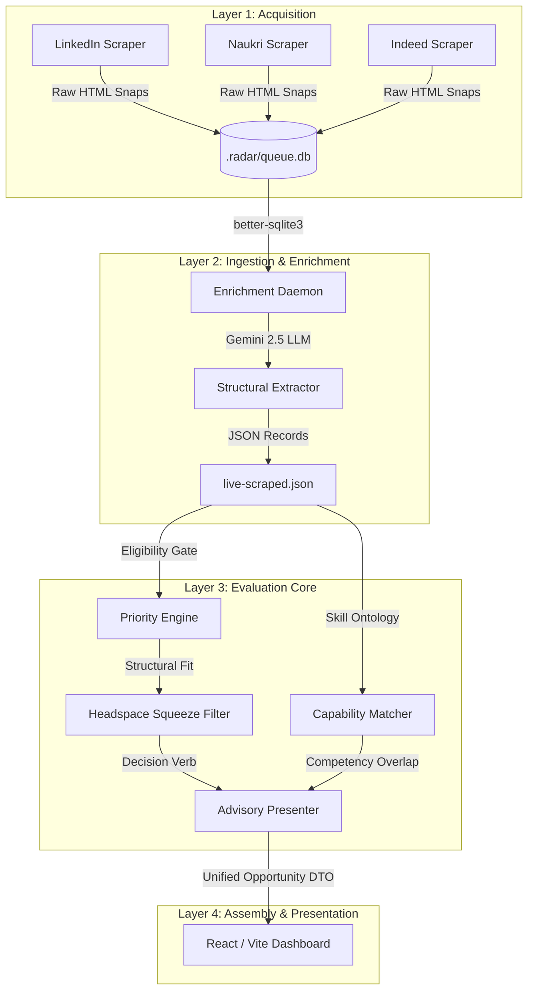

# 📡 RADAR — Career Opportunity Advisory & Intelligence Engine

> **RADAR** is an evidence-anchored, highly selective career intelligence engine built for executive-level commercial growth leaders. It scans public job portals, extracts deep corporate structural and organizational signals, and maps opportunities against your candidate profile using decoupled priority and competency scoring.

---

## 🛠️ System Architecture & Codebase Map

RADAR's lifecycle is structured into four sequential, decoupled layers:



---

### 1. Acquisition (The Crawling Core)
* **Purpose**: Executes target marketing/growth leadership keyword search queries across portals, gathers job description cards, and captures raw page dumps.
* **Files**:
  * **[scripts/scrape.ts](file:///C:/Users/swapn/Downloads/radar-local-v2/scripts/scrape.ts)**: Orchestrates the parallel crawling of portals using Playwright.
  * **[scripts/scraper/portals/](file:///C:/Users/swapn/Downloads/radar-local-v2/scripts/scraper/portals/)**: Portal-specific selector and pagination scripts (e.g., `linkedin.ts`, `naukri.ts`, `indeed.ts`).
  * **Yield Throttle Rules**: Applies deduplication of canonical job URLs and hashes across search query sets. Features an early-stopping mechanism (`ConsecutiveLowYield`) to abort scans early if consecutive duplicate rows are detected, avoiding IP bans and redundant calls.

### 2. Ingest & Enrichment (The LLM Ingestion Layer)
* **Purpose**: Pulls raw HTML snapshots from the enrichment queue database, passes them to Gemini 2.5 Flash to extract canonical dimension attributes, and outputs enriched structured JSON files.
* **Files**:
  * **[scripts/enrich.ts](file:///C:/Users/swapn/Downloads/radar-local-v2/scripts/enrich.ts)**: Multi-threaded LLM extraction daemon that leases jobs from SQLite, sanitizes text, and runs structured schema inference.
  * **[scripts/scraper/persist/queue.ts](file:///C:/Users/swapn/Downloads/radar-local-v2/scripts/scraper/persist/queue.ts)**: Manages enrichment task leases, statuses, error rates, and retry counts.

### 3. Evaluation (Decoupled Core Engines)
RADAR evaluates jobs using two independent, parallel evaluation systems:
* **Structural Priority Engine**:
  * **File**: **[src/lib/intelligence/priority.ts](file:///C:/Users/swapn/Downloads/radar-local-v2/src/lib/intelligence/priority.ts)** & **[src/lib/intelligence/pipeline.ts](file:///C:/Users/swapn/Downloads/radar-local-v2/src/lib/intelligence/pipeline.ts)**
  * **Formula**:
    $$\text{Priority} = \frac{\text{CareerValue} \times \text{ShortlistingPotential}}{\text{PursuitFriction}}$$
    * $\text{CareerValue}$: Matches level, mandate, and commercial accountability with your ambition.
    * $\text{ShortlistingPotential}$: Overall Jaccard similarity and concentric rings matching.
    * $\text{PursuitFriction}$: High reporting complexity, geography misalignment, and work-model mismatch.
  * **Decision Verbs**: If $\text{Priority} \ge 55\% \rightarrow \text{PURSUE}$. If $\text{Priority} \ge 30\% \rightarrow \text{CONSIDER}$. Otherwise, `PASS` (or excluded from shortlist).
* **Capability Match Engine**:
  * **File**: **[src/lib/recommendation/CapabilityRecommendationScorer.ts](file:///C:/Users/swapn/Downloads/radar-local-v2/src/lib/recommendation/CapabilityRecommendationScorer.ts)**
  * **Purpose**: Compares specific professional credentials from your profile (`cap_business_turnaround`, `cap_crm_strategy`, etc.) to the raw job description to calculate the **Pursuit Potential Score** (displayed as a percentage score out of 100).

### 4. Assembly & Presentation
* **Purpose**: Wires the pipeline, capabilities, and narrative formatter together, resolving them into a single, cohesive `Opportunity` DTO for React.
* **Files**:
  * **[src/lib/intelligence/present.ts](file:///C:/Users/swapn/Downloads/radar-local-v2/src/lib/intelligence/present.ts)**: Wires the pipeline results, runs the capability matcher, applies calibration, and generates the final narrative.
  * **[src/lib/intelligence/opportunity-provider.ts](file:///C:/Users/swapn/Downloads/radar-local-v2/src/lib/intelligence/opportunity-provider.ts)**: UI data supplier interface.

---

## 💾 Database Models & Persistence

RADAR leverages two key data storage models to preserve state and ensure scraping robustness:

### 1. Main Ingest Database (`radar.sqlite`)
* **Purpose**: Serves as the primary operational database housing finalized opportunities, structured dimensions, and candidate profile snapshots.
* **Tables**:
  * `opportunities`: Job summaries, source URL, role title, company, and location.
  * `opportunity_dimensions`: Extracted verbatim evidence, confidence metrics, and matching statuses.
  * `assessments`: History of recommendation records, scores, and decision confidence.

### 2. Enrichment Queue Database (`.radar/queue.db`)
* **Purpose**: A highly resilient SQLite transactional queue implementing **mutual-exclusion leasing** to enable multi-threaded extraction workers to operate concurrently without double-processing.
* **Tables**:
  * `enrichment_jobs`: Manages individual scrape records with columns for `status` (`PENDING`, `LEASED`, `RUNNING`, `FAILED`, `COMPLETE`), `attempts`, `lease_expires_at`, and `failure_type`.
  * `enrichment_events`: Keeps transactional logs of LLM timeouts, parsing failures, and worker operations for self-healing runs.

---

## 🚦 Operational Rules & Controls

### ⚖️ The Asymmetric Headspace Saturation Filter
To keep your executive calendar free from saturation, the system limits how many jobs can be pursued at once.
* **Trigger File**: **[src/lib/intelligence/headspace-filter.ts](file:///C:/Users/swapn/Downloads/radar-local-v2/src/lib/intelligence/headspace-filter.ts)**
* **Mechanism**:
  * Your maximum concurrent bandwidth is defined by `headspaceCapacityPerMonth` in `candidate-profile.json` (defaults to `5` if omitted).
  * If the number of jobs you have manually marked as `PURSUE` meets or exceeds this capacity (e.g., you have 4 active pursuits and capacity is 4), the workspace becomes **Saturated**.
  * Any new high-priority job that would normally qualify for `PURSUE` ($\ge 0.55$) is **automatically downgraded to `CONSIDER`** with a protective bandwidth-saturation notice. This is why high-matching roles (e.g., 35% capability) can reside in `CONSIDER` while active items in `PURSUE` might carry lower scores.

---

## 🚀 Operating Instructions

Get up and running locally:

### 1. Installation
Install all dependencies using NPM:
```powershell
npm install
```

### 2. Run the Dashboard Console
Launch the local Vite-powered React dashboard:
```powershell
npm run dev
```

### 3. Trigger a Fresh Scrape
Run a fresh multi-portal crawl across all 34 marketing leadership search keywords:
```powershell
npm run scrape
```

### 4. Run the Enrichment Daemon
Enrich scraped snapshots in the queue using Gemini 2.5 Flash:
```powershell
npm run enrich
```

### 5. Run accepted Quality Assurance tests
Ensure the scoring engines, ontological classifiers, and schemas are aligned:
```powershell
npm run test:eqe
```

### 6. Lint and Build the Code
Verify correctness and output the optimized production bundle:
```powershell
npm run lint
npm run build
```