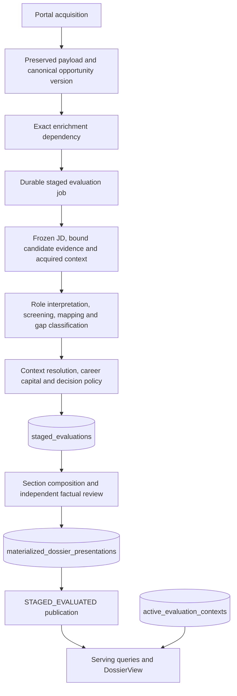

# RADAR architecture

Current implementation reference, reconciled against `433588c` on 19 September 2026. This describes code, not a claim about the deployed release or current
backfill counts. The [product mission](PRODUCT_MISSION.md) governs
product behavior; the [documentation index](README.md) lists current operational guidance.

## Product and boundaries

RADAR produces an executive pursuit decision and a rich dossier from three
evidence planes: role/JD, explicitly bound candidate sources, and acquired company
context. The model interprets meaning; the application owns identity, provenance,
schema validation, policy constraints, lifecycle, persistence and activation.
Grounded inference, visible EXPLICIT/INFERRED cues, narrative variation and both
approved dossier templates remain product requirements.

Persisting an evaluation, composing a dossier and publishing a projection do not
switch the active context. Shadow work can therefore succeed without becoming
user-visible. For an already active staged context, the worker also performs
composition/publication; an inactive shadow context stops at evaluation persistence
unless composition/publication is explicitly requested.

## Canonical code map

| Responsibility                                                | Implementation                                                                                                                                             |
| ------------------------------------------------------------- | ---------------------------------------------------------------------------------------------------------------------------------------------------------- |
| Acquisition and enrichment                                    | `scripts/scraper/`, `scripts/scrape.ts`, `scripts/enrich.ts`                                                                                               |
| Dependency scheduling                                         | `src/lib/intelligence/EvaluationWorkScheduler.ts`, `scripts/scraper/persist/queue.ts`                                                                      |
| Durable claims and worker lifecycle                           | `src/lib/intelligence/EvaluationWorker.ts`                                                                                                                 |
| Immutable production input                                    | `src/lib/intelligence/staged/ProductionStagedInputAdapter.ts`                                                                                              |
| Company retrieval and acquisition recipe                      | `src/lib/intelligence/staged/ProductionContextProvider.ts`, `contextAcquisitionPolicy.ts`                                                                  |
| Claim extraction, source fingerprints and candidate conflicts | `src/dossier/evidence.ts`                                                                                                                                  |
| Role/mapping contracts and application-assigned IDs           | `src/dossier/staged-role.ts`                                                                                                                               |
| Screening quote IDs and derived gates                         | `src/dossier/staged-screening.ts`                                                                                                                          |
| Decision orchestration, contracts and validation              | `src/dossier/staged-decision.ts`, `staged-decision-contract.ts`, `staged-decision-integrity.ts`                                                            |
| Composition and factual review                                | `src/dossier/composition.ts`, `staged-composition.ts`, `factual-review-integrity.ts`                                                                       |
| Durable composition requests                                  | `src/lib/intelligence/staged/DurableDossierModel.ts`                                                                                                       |
| Persistence and activation pointers                           | `src/data/sqlite/repositories/SqliteStagedInputStore.ts`, `SqliteStagedEvaluationStore.ts`, `SqliteRichDossierStore.ts`, `SqliteEvaluationContextStore.ts` |
| Publication and readiness                                     | `src/lib/intelligence/staged/StagedServingPublisher.ts`, `stagedDossierHealth.ts`, `StagedRolloutReadiness.ts`                                             |
| Both presentation templates                                   | `src/dossier/DossierView.tsx`, using the shared `contracts.ts` model                                                                                       |

## Identity and provenance

| Identity                                  | Meaning                                                                                                                                     |
| ----------------------------------------- | ------------------------------------------------------------------------------------------------------------------------------------------- |
| `canonicalJobId` / `opportunityVersion`   | The canonical job and the exact acquired version under evaluation                                                                           |
| `tenantId` / `personId`                   | Authorization and candidate scope                                                                                                           |
| `profileVersion`                          | The explicitly bound candidate projection and its reconstructible source bindings; no latest-CV substitution                                |
| `evaluationContextFingerprint`            | Hash of tenant/person, search-plan snapshot, ontology version/fingerprint, policy and profile; v8 also includes the acquisition recipe      |
| `inputFingerprint` / `sourceFingerprints` | The frozen input and its source identities, distinct from the resulting evaluation                                                          |
| Full evaluation fingerprint               | `createStagedEvaluationFingerprint` binds context, input and canonical evaluation content; dossier lookup and publication use this identity |

`computeEvaluationContextFingerprint` lives in
`src/lib/domain/evaluation_fingerprint.ts`. Staged persistence is scoped by tenant,
person, job, opportunity version and context. Changing semantics must not silently
reuse an existing policy/context. Canonical staged JSON is validated on persistence
and rehydration; dossier storage also validates factual-review provenance and the
canonical decision trace.

## Semantic stages

The role interpreter emits requirements and their REQUIRED/PREFERRED strength.
The application builds immutable JD quote catalogs. Screening returns
`supportQuoteIds`, `screeningFunction` and `gateBasis`; it does not author the final
gate boolean. The application derives a gate only for REQUIRED entry qualifications
with a non-NONE basis. Candidate mapping independently answers whether supplied
candidate evidence establishes the requirement.

Unresolved gates are classified by gap nature. `MISSING_EXPERIENCE` and
`AFFIRMATIVE_CONFLICT` require BLOCKED screening and PASS; `MISSING_ARTIFACT` and
`PARTIAL_EVIDENCE` constrain screening to at most FRAGILE. Directly satisfied
requirements cannot be reopened as screening drivers. Authority and career-capital
tradeoffs remain separate from employer entry qualifications.

Candidate-source disagreements are computed without choosing a winning source.
Acquisition records distinguish retrieval from field resolution: retrieving a
source does not establish every requested fact. Missing context configuration or
provider failure is not a successful no-results search.

## Versions, recovery and serving

Current contracts are `staged-v8`, `staged-decision-v8`, `dossier-v4.1` and
`memo-facts-v4`. Existing v6/v7 records and historical presentations retain
their own meaning. Fresh v7 acquisition/new v7 rollout is not an alternative to v8.

Migration 050 stores frozen inputs; migration 051 stores durable dossier model
checkpoints. Checkpoints bind the evaluation, composition/review recipe, model
configuration and exact request. Reused responses are validated; provider failures
are not cached. An old accepted section is not automatically valid under a new
review policy. Existing immutable presentation rows are not overwritten to conceal
corruption.

`staged_waiting_enrichment` means the worker cannot claim the dependency yet.
Inspect `evaluation_requirements` as well: a FAILED requirement needs an explicit,
validated recovery path, not a forced status update. Exact job/version/pipeline
matching matters. An idle queue does not prove population coverage.

Readiness checks the eligible, active, acquired search-plan cohort, valid dossiers,
publications and operational context receipts, with valid PASS evaluations counted
as prepared without a dossier. It does not inventory pre-ingestion blobs or every
excluded/out-of-cohort record. The captured-opportunities surface distinguishes
evaluated PASS results from outstanding processing. Historical population backfill
is outside the current fresh-scrape scope.

## Runtime boundaries

The unused monolithic research runner, duplicate staged screening/research runner,
experimental extraction providers and unused presentation modules were removed.
The live semantic screening lab remains in `src/dossier/screening-semantic-lab.ts`
with `scripts/screening-semantic-corpus.ts`. Scraper dependencies, migrations,
historical data readers and still-called compatibility paths remain. New work uses the current paths above; the source tree contains no alternate
monolithic research runner.

## Executive memo generation

The canonical production presentation is `dossier-v4.1` / `staged-memo-v4.1`.
The staged decision remains v8: editorial changes never rewrite its immutable trace.
One Bedrock Mantle request writes the complete six-section memo and its narrative plan.
`createBedrockGlmResearchModel` returns `BedrockMantleJsonModel`, using GLM-5 through
`https://bedrock-mantle.us-east-1.api.aws/v1/chat/completions`. Native JSON Schema
output feeds the existing canonical validators; truncated/refused/invalid JSON is
never accepted. Provider failures return to durable scheduling without immediate
transport retries. The adapter normalizes token usage and binds transport, model,
region and output settings into checkpoint identity. Converse checkpoints cannot
be reused as Mantle responses. This transport change does not rewrite persisted
evaluations or change the staged policy, prompts, candidate source or verdict rules.
Its stable candidate packet contains all validated candidate facts and exact source
bindings, separate from role and company context. Production extraction already
caches candidate claims by source and model identity; no job-specific CV rewrite
or second candidate truth store is introduced. Owner-authored factual scope notes
in a bound candidate source are carried verbatim to the writer and reviewer, so
summary extraction cannot silently discard tenure or commercial-amount qualifiers.
A source amendment receives a new profile/source binding; completed evaluations
continue using their original immutable profile.

The writer targets 450-600 words, with a 650-word main-memo ceiling, short bullets,
grouped fit arguments and one primary home per material point. Distinct preparation
is optional and expandable. Full requirements, scope and source evidence remain in
the reference. Section allocations guide the writer; the overall memo and preparation
ceilings are enforced again at persistence/serving boundaries. Repairs return only
affected blocks through a restricted schema; accepted blocks are preserved rather
than rewritten. No text is truncated.

Draft publication is independent of factual review. The evaluation worker writes
a structurally validated memo, enqueues it in `dossier_review_jobs`, and publishes
`dossier-v4.1-draft` for an already active context. The draft has no review receipts
and the serving DTO explicitly labels its status. PASS still skips composition.

The separate `DossierReviewWorker` uses a provider-neutral `ReasoningModel` factory.
Gemini is the default. One compact review checks factual support, material point coverage and
consistency with the fixed action. It sees all candidate facts plus cited role and
context evidence. It requires a source comparison for every passage, including first-person outreach,
with explicit attention to duration, sector and projection qualifiers. It reports
all factual and coverage defects together; minor
stylistic suggestions do not block publication. Exact section receipts permit reuse
of unchanged accepted sections during repair; durable request checkpoints preserve
writer proposals and review responses across process restarts. Each request binds
its own model configuration; changing the reviewer does not invalidate writer
checkpoints. Formatting repair and factual repair have separate bounded budgets.
Provider failures
never consume semantic repairs or turn into accepted text.

Migration 052 persists a shared review lane, exact draft hash, evaluation identity,
lease, due time and retry state. A 429 pauses only review; the labelled draft remains
available. An adverse factual finding withholds draft prose immediately, even if
the same response has a coverage bookkeeping defect. The opportunity and user
decision remain available. Heartbeats protect long requests; lease-fenced completion
atomically saves reviewed output and upgrades an existing publication. A review
never creates serving activation. Polling visible pending dossier pages refreshes
the DTO every 30 seconds. Reviewed storage continues to reject unreviewed output.

Gemini 3.8 Flash explicitly caches the immutable candidate evidence, source binding,
clarifications and reviewer instructions for one hour. The content hash includes the
model and complete shared packet; changed sources or instructions cannot reuse an
older cache. Job evidence, passages and decisions stay request-specific. Unexpired
cloud metadata permits reuse after worker restarts. Inputs below the provider's
4,096-token minimum are sent intact without padding. Unsupported cache permissions
fall back to the complete request; rate limits pause durable work. Set
`RADAR_GEMINI_CONTEXT_CACHE=off` to disable this optimization. Generation usage
records expose `cachedContentTokenCount`; caching reduces repeated input work and
cost, but does not guarantee relief from shared-capacity 429 responses.
The reviewer retains medium reasoning with a 16,384-token total output ceiling;
this includes internal thinking as well as structured review JSON. Memo word limits
are independent. Incomplete output is rejected with its completion reason recorded.

Template B is the only renderer: a single-column header, narrow section-bounded
sticky rail (normal flow on mobile), short fit labels and compact question/impact
pairs. Empty preparation channels are omitted.

The shortlist displays screening viability and evidence coverage instead of a
fabricated fit score. Viability is distinct from career fit and the pursuit verdict.
For active contexts the durable evaluation worker drafts and publishes only
PURSUE/CONSIDER results. PASS remains a completed evaluation, with `passSkipped`
reported by readiness; it is not missing dossier work. No automatic context
activation is introduced.
