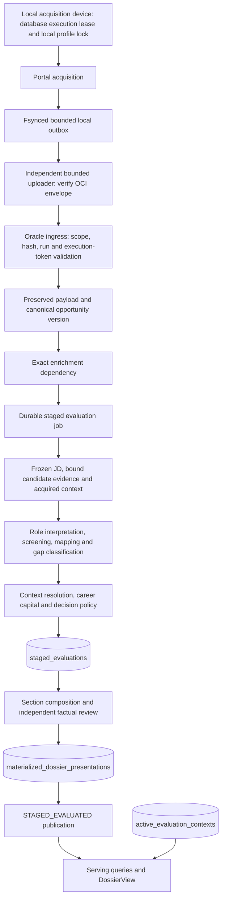

# RADAR architecture

Current implementation reference, reconciled against `433588c` on 19 September 2026. This describes code, not a claim about the deployed release or current
backfill counts. The [product mission](PRODUCT_MISSION.md) governs
product behavior; the [documentation index](README.md) lists current operational guidance.

## Product and boundaries

RADAR produces an executive pursuit decision and a rich dossier from three
evidence planes: role/JD, explicitly bound candidate sources, and acquired company
context. The model interprets meaning; the application owns identity, provenance,
schema validation, policy constraints, lifecycle, persistence and activation.
Grounded inference, visible EXPLICIT/INFERRED cues, narrative variation and both
approved dossier templates remain product requirements.

### Multi-tenant product invariant

RADAR is a multi-tenant product. Tenant isolation is a permanent product and
architecture invariant, not a rollout phase or a legacy transition concern. A
successful dossier is not authorization to weaken ownership boundaries.

Every customer-owned durable resource must carry `tenant_id` or derive its tenant
through a database-enforced ownership relationship. This includes people and their
candidate sources, search plans and snapshots, credentials, scrape runs and their
work, evaluation contexts and evaluations, dossiers, decisions, and their serving
projections. A global market corpus may be shared only when it contains no
tenant-owned candidate data and is explicitly modelled as global.

The authorization chain is always `authenticated user → active membership → tenant
→ authorized person → tenant-owned resource`. Membership in a tenant does not by
itself authorize access to every person in that tenant: the requested person must
be selected explicitly and authorized against the membership's permissions. New
read paths and writes must preserve the tenant/person identity through to the
database predicate, unique key, or enforced foreign-key relationship; they must
not infer a global “current candidate” or select an unscoped latest record.

Pre-production simplifies migration and release mechanics, not this domain model.
Any exception to the invariant requires a documented global-data classification
and a test showing that it cannot expose tenant-owned data across boundaries.

```mermaid
flowchart TD
  X[Local acquisition device: database execution lease and local profile lock] --> A
  A --> Q[Fsynced bounded local outbox]
  Q --> Y[Independent bounded uploader: verify OCI envelope]
  Y --> Z[Oracle ingress: scope, hash, run and execution-token validation]
  Z --> B
  A[Portal acquisition]
  B[Preserved payload and canonical opportunity version]
  B --> C[Exact enrichment dependency]
  C --> D[Durable staged evaluation job]
  D --> E[Frozen JD, bound candidate evidence and acquired context]
  E --> F[Role interpretation, screening, mapping and gap classification]
  F --> G[Context resolution, career capital and decision policy]
  G --> H[(staged_evaluations)]
  H --> I[Section composition and independent factual review]
  I --> J[(materialized_dossier_presentations)]
  J --> K[STAGED_EVALUATED publication]
  K --> L[Serving queries and DossierView]
  M[(active_evaluation_contexts)] --> L
```

Distributed portal execution is serialized by migration 071's database-clock
execution lease. Run leases remain the authority for scoped run mutations. Local
locks protect profiles, not cross-host ownership. Oracle is processing-only; every
canonical processing source is in OCI. Shared payloads exclude browser HTML and
duplicate full-JD fields while preserving distinct evidence. Source refresh bypasses
local source snapshots; it does not manufacture a new canonical version for the
same content. Acknowledged handoff staging and inactive diagnostic caches expire
under reference-aware cleanup; canonical and pending sources do not. Exact classes,
timing and commands are in [OCI storage](OCI_STORAGE.md).

Persisting an evaluation, composing a dossier and publishing a projection do not
switch the active context. Shadow work can therefore succeed without becoming
user-visible. For an already active staged context, the worker also performs
composition/publication; an inactive shadow context stops at evaluation persistence
unless composition/publication is explicitly requested.

## Canonical code map

| Responsibility                                                | Implementation                                                                                                                                             |
| ------------------------------------------------------------- | ---------------------------------------------------------------------------------------------------------------------------------------------------------- |
| Acquisition contracts, planning and web boundary              | `src/acquisition/`                                                                                                                                         |
| Acquisition execution and enrichment workers                  | `scripts/scraper/`, `scripts/scrape.ts`, `scripts/enrich.ts`                                                                                               |
| Opportunity serving, pagination and application actions       | `src/opportunity/`                                                                                                                                         |
| Dependency scheduling                                         | `src/evaluation/work-scheduler.ts`, `scripts/scraper/persist/queue.ts`                                                                                     |
| Durable claims and worker lifecycle                           | `src/evaluation/worker.ts`                                                                                                                                 |
| Immutable production input                                    | `src/evaluation/staged-input.ts`                                                                                                                           |
| Company retrieval and acquisition recipe                      | `src/evaluation/context-provider.ts`, `src/evaluation/context-acquisition-policy.ts`                                                                       |
| Claim extraction, source fingerprints and candidate conflicts | `src/dossier/evidence.ts`                                                                                                                                  |
| Role/mapping contracts and application-assigned IDs           | `src/dossier/staged-role.ts`                                                                                                                               |
| Screening quote IDs and derived gates                         | `src/dossier/staged-screening.ts`                                                                                                                          |
| Decision orchestration, contracts and validation              | `src/dossier/staged-decision.ts`, `staged-decision-contract.ts`, `staged-decision-integrity.ts`                                                            |
| Composition and factual review                                | `src/dossier/composition.ts`, `staged-composition.ts`, `factual-review-integrity.ts`                                                                       |
| Durable composition requests                                  | `src/dossier/runtime/durable-model.ts`                                                                                                                     |
| Persistence and activation pointers                           | `src/data/sqlite/repositories/SqliteStagedInputStore.ts`, `SqliteStagedEvaluationStore.ts`, `SqliteRichDossierStore.ts`, `SqliteEvaluationContextStore.ts` |
| Publication and readiness                                     | `src/dossier/runtime/serving-publisher.ts`                                                                                                                 |
| Canonical dossier presentation                                | `src/dossier/DossierView.tsx`, using the shared `contracts.ts` model                                                                                       |

## Identity and provenance

| Identity                                  | Meaning                                                                                                                                     |
| ----------------------------------------- | ------------------------------------------------------------------------------------------------------------------------------------------- |
| `canonicalJobId` / `opportunityVersion`   | The canonical job and the exact acquired version under evaluation                                                                           |
| `tenantId` / `personId`                   | Authorization and candidate scope                                                                                                           |
| `profileVersion`                          | The explicitly bound candidate projection and its reconstructible source bindings; no latest-CV substitution                                |
| `evaluationContextFingerprint`            | Hash of tenant/person, search-plan snapshot, ontology version/fingerprint, policy and profile; v8 also includes the acquisition recipe      |
| `inputFingerprint` / `sourceFingerprints` | The frozen input and its source identities, distinct from the resulting evaluation                                                          |
| Full evaluation fingerprint               | `createStagedEvaluationFingerprint` binds context, input and canonical evaluation content; dossier lookup and publication use this identity |

`computeEvaluationContextFingerprint` lives in
`src/evaluation/fingerprint.ts`. Staged persistence is scoped by tenant,
person, job, opportunity version and context. Changing semantics must not silently
reuse an existing policy/context. Canonical staged JSON is validated on persistence
and rehydration; dossier storage also validates factual-review provenance and the
canonical decision trace.

## Semantic stages

The role interpreter emits requirements and their REQUIRED/PREFERRED strength.
The application builds immutable JD quote catalogs. Screening returns
`supportQuoteIds`, `screeningFunction` and `gateBasis`; it does not author the final
gate boolean. The application derives a gate only for REQUIRED entry qualifications
with a non-NONE basis. Candidate mapping independently answers whether supplied
candidate evidence establishes the requirement.

Unresolved gates are classified by gap nature. `MISSING_EXPERIENCE` and
`AFFIRMATIVE_CONFLICT` require BLOCKED screening and PASS; `MISSING_ARTIFACT` and
`PARTIAL_EVIDENCE` constrain screening to at most FRAGILE. Directly satisfied
requirements cannot be reopened as screening drivers. Authority and career-capital
tradeoffs remain separate from employer entry qualifications.

Candidate-source disagreements are computed without choosing a winning source.
Acquisition records distinguish retrieval from field resolution: retrieving a
source does not establish every requested fact. Missing context configuration or
provider failure is not a successful no-results search.

## Versions, recovery and serving

Current contracts are `staged-v8`, `staged-decision-v8`, `dossier-v4.1` and
`memo-facts-v4`. Existing v6/v7 records and historical presentations retain
their own meaning. Fresh v7 acquisition/new v7 rollout is not an alternative to v8.

Migration 050 stores frozen inputs; migration 051 stores durable dossier model
checkpoints. Checkpoints bind the evaluation, composition/review recipe, model
configuration and exact request. Reused responses are validated; provider failures
are not cached. An old accepted section is not automatically valid under a new
review policy. Existing immutable presentation rows are not overwritten to conceal
corruption.

`staged_waiting_enrichment` means the worker cannot claim the dependency yet.
Inspect `evaluation_requirements` as well: a FAILED requirement needs an explicit,
validated recovery path, not a forced status update. Exact job/version/pipeline
matching matters. An idle queue does not prove population coverage.

Readiness checks the eligible, active, acquired search-plan cohort, valid dossiers,
publications and operational context receipts, with valid PASS evaluations counted
as prepared without a dossier. It does not inventory pre-ingestion blobs or every
excluded/out-of-cohort record. The captured-opportunities surface distinguishes
evaluated PASS results from outstanding processing. Historical population backfill
is outside the current fresh-scrape scope.

## Pursuit execution

`src/pursuit/` is the execution continuation of a reviewed opportunity. The
canonical decision store records PURSUE in the same transaction that opens the
tenant/person scoped pursuit. The Candidate Evidence Ledger projects only the
current profile source bindings; edits to Pursuit artifacts do not change
candidate truth. A thesis retains the opportunity, evaluation, profile and
source-binding lineage used to derive it. Mandate relationships remain separate
from source provenance, and dossier judgments cap the strength of a Pursuit
claim.

The `pursuit-preparation` worker prepares a versioned thesis and artifact
package through a durable queue. Successful model stages are checkpointed, and
thesis insertion commits with its checkpoint. Artifact publication, active
thesis selection and job completion commit together under the current lease.
When a target runs Pursuit, the worker is supervised and included in that target's
readiness checks. Model calls use the shared `model_invocations` table with
`pipeline='pursuit'`, pursuit and
preparation IDs. Migration 069 widens that table while retaining its existing
status constraint and indexes. The Cockpit polls a narrow preparation status
read and refreshes the full view after a state change.

## Runtime boundaries

RADAR is pre-production and runtime topology is target-specific. Repository
capability does not imply that every worker must run on every deployed host. In
particular, browser scraping and its Chromium/Playwright dependency belong only on
a runtime that actually executes scraping; web/Pursuit/dossier readiness should not
invent a scraper requirement for a target where scraping is intentionally absent.
Verification and deployment policy is defined in
`docs/VERIFICATION_AND_RELEASE.md`.

The live semantic screening lab remains in `src/dossier/screening-semantic-lab.ts`
with `scripts/run-corpus-regeneration-worker.ts` and `scripts/corpus/`. Scraper dependencies, migrations,
historical data readers and still-called compatibility paths remain. New work uses the current paths above; the source tree contains no alternate
monolithic research runner.

## Executive memo generation

The canonical production presentation is `dossier-v4.1` / `staged-memo-v4.1`.
The staged decision remains v8: editorial changes never rewrite its immutable trace.
One Bedrock Mantle request writes the complete six-section memo and its narrative plan.
`createBedrockGlmResearchModel` returns `BedrockMantleJsonModel`, using GLM-5 through
`https://bedrock-mantle.us-east-1.api.aws/v1/chat/completions`. Native JSON Schema
output feeds the existing canonical validators; truncated/refused/invalid JSON is
never accepted. Provider failures return to durable scheduling without immediate
transport retries. The adapter normalizes token usage and binds transport, model,
region and output settings into checkpoint identity. Converse checkpoints cannot
be reused as Mantle responses. This transport change does not rewrite persisted
evaluations or change the staged policy, prompts, candidate source or verdict rules.
Its stable candidate packet contains all validated candidate facts and exact source
bindings, separate from role and company context. Production extraction already
caches candidate claims by source and model identity; no job-specific CV rewrite
or second candidate truth store is introduced. Owner-authored factual scope notes
in a bound candidate source are carried verbatim to the writer and reviewer, so
summary extraction cannot silently discard tenure or commercial-amount qualifiers.
A source amendment receives a new profile/source binding; completed evaluations
continue using their original immutable profile.

The writer targets 450-600 words, with a 650-word main-memo ceiling, short bullets,
grouped fit arguments and one primary home per material point. Distinct preparation
is optional and expandable. Full requirements, scope and source evidence remain in
the reference. Section allocations guide the writer; the overall memo and preparation
ceilings are enforced again at persistence/serving boundaries. Repairs return only
affected blocks through a restricted schema; accepted blocks are preserved rather
than rewritten. No text is truncated.

Draft publication is independent of factual review. The evaluation worker writes
a structurally validated memo, enqueues it in `dossier_review_jobs`, and publishes
`dossier-v4.1-draft` for an already active context. The draft has no review receipts
and the serving DTO explicitly labels its status. PASS still skips composition.

The separate `DossierReviewWorker` uses a provider-neutral `ReasoningModel` factory.
Gemini is the default. One compact review checks factual support, material point coverage and
consistency with the fixed action. It sees all candidate facts plus cited role and
context evidence. It requires a source comparison for every passage, including first-person outreach,
with explicit attention to duration, sector and projection qualifiers. It reports
all factual and coverage defects together; minor
stylistic suggestions do not block publication. Exact section receipts permit reuse
of unchanged accepted sections during repair; durable request checkpoints preserve
writer proposals and review responses across process restarts. Each request binds
its own model configuration; changing the reviewer does not invalidate writer
checkpoints. Formatting repair and factual repair have separate bounded budgets.
Provider failures
never consume semantic repairs or turn into accepted text.

Migration 052 persists a shared review lane, exact draft hash, evaluation identity,
lease, due time and retry state. A 429 pauses only review; the labelled draft remains
available. An adverse factual finding withholds draft prose immediately, even if
the same response has a coverage bookkeeping defect. The opportunity and user
decision remain available. Heartbeats protect long requests; lease-fenced completion
atomically saves reviewed output and upgrades an existing publication. A review
never creates serving activation. Polling visible pending dossier pages refreshes
the DTO every 30 seconds. Reviewed storage continues to reject unreviewed output.

Gemini 3.8 Flash explicitly caches the immutable candidate evidence, source binding,
clarifications and reviewer instructions for one hour. The content hash includes the
model and complete shared packet; changed sources or instructions cannot reuse an
older cache. Job evidence, passages and decisions stay request-specific. Unexpired
cloud metadata permits reuse after worker restarts. Inputs below the provider's
4,096-token minimum are sent intact without padding. Unsupported cache permissions
fall back to the complete request; rate limits pause durable work. Set
`RADAR_GEMINI_CONTEXT_CACHE=off` to disable this optimization. Generation usage
records expose `cachedContentTokenCount`; caching reduces repeated input work and
cost, but does not guarantee relief from shared-capacity 429 responses.
The reviewer retains medium reasoning with a 16,384-token total output ceiling;
this includes internal thinking as well as structured review JSON. Memo word limits
are independent. Incomplete output is rejected with its completion reason recorded.

Template B is the only renderer: a single-column header, narrow section-bounded
sticky rail (normal flow on mobile), short fit labels and compact question/impact
pairs. Empty preparation channels are omitted.

The shortlist displays screening viability and evidence coverage instead of a
fabricated fit score. Viability is distinct from career fit and the pursuit verdict.
For active contexts the durable evaluation worker drafts and publishes only
PURSUE/CONSIDER results. PASS remains a completed evaluation, with `passSkipped`
reported by readiness; it is not missing dossier work. No automatic context
activation is introduced.

## Indicative titles and shortlist membership

Search-plan role labels, function words and designation-derived seniority are
advisory acquisition signals. A missing phrase match or unusual title produces
REVIEW and continues to the existing evaluator, including context activation and
canonical-pool materialization. Title-only function/seniority suspicions also
produce REVIEW. Explicit company/employment/geography constraints, unusable
capture and clear JD experience contradictions keep their blocking behavior.

The canonical shortlist includes ELIGIBLE or REVIEW associations only after a
valid current-context STAGED_EVALUATED PURSUE/CONSIDER result, with no user
selection yet. Feed, navigation and actionable queue count share this predicate.
REVIEW is not a shortlist recommendation by itself; PASS, invalid, unevaluated,
explicitly ineligible and decided rows remain excluded. Acquisition uncertainty
is retained for reasoning rather than overwritten as proven role equivalence.

## Scraped-job decision log

`/scraped` lists the scoped acquisition population and applies lifecycle filters in
SQL before pagination. Tile totals cover the complete active-search population.
The URL retains the selected state and page when navigating to a decision log and
back. Detail links bind the canonical job and opportunity version; ambiguous
portal job IDs fail closed rather than selecting an unrelated role.

`/scraped/$jobHash` is a read-only view of that version's recorded attention gate,
current-context evaluation, role requirements, screening classification, candidate
mapping, gaps and decision hinges. Feed and detail use the same lifecycle SQL.
READY requires the current reviewed rich presentation bound to the serving
fingerprint; draft/preparing publications remain PREPARING. Explicit intake
exclusions and advisory designation uncertainty are explained separately.

Evidence quotations are read only from the evaluation's matching frozen input,
validated with its existing fingerprint/provenance contract. Role and candidate
claims retain separate planes and EXPLICIT/INFERRED cues. Missing or invalid frozen
inputs cannot produce invented quotations. The capture timestamp belongs to the
selected opportunity version. This view does not generate new evaluations or
compose PASS dossiers; persisted verdicts and source identities remain unchanged.

Implementation: `src/acquisition/feed-read-model.ts`, `pipeline-state.ts`,
`detail-read-model.ts`, authenticated `feed.ts`/`detail-server.ts`, and the two
Scraped routes. Decision-log regressions are included in release certification.

## Administration foundations

`src/admin` and `/admin` provide Phase 1 visibility, Phase 2 protection and Phase 3 narrow configuration writes.
Migration 072 separates platform roles and append-only audit from tenant
memberships, and adds idempotent usage rollups. See
[Administration](ADMINISTRATION.md). Migration 073 adds tenant quotas, expiring
quota overrides, scoped claim controls, persistent job/call reservations, deferrals
and console alerts. Migration 074 separates first-claim month from token month,
records legacy processing leases and adds count-based storm recovery. Local DB
adapters serialize same-process operations to avoid async transaction contention.
Evaluation, composition, factual review, pursuit and scrape
claims reserve in the same database transaction as their fenced queue claim.
The invocation sink uses `JobTokenLedger` before Mantle/Gemini dispatch and reconciles
measured usage after completion. No policy is activated automatically. Deferrals
are operational state, not opportunity verdicts; existing source identity, engine
semantics and memo publication rules are preserved. See the administration runbook
for activation boundaries, conservative input admission and unknown usage.

Migration 075 pins an immutable effective engine revision to each model-backed
queue job at enqueue. `config-store` owns draft, publish and revert-as-new-draft
behavior; `model-gateway` resolves the two configured lanes from the pinned row.
The baseline keeps existing host factories. Explicit Mantle assignments bind
model and request configuration with no vendor fallback. Candidate intent, stage
order and source integrity stay in their current domain implementations.

`BenchWorker` processes scoped, leased synthetic fixture runs independently of
acquisition. It invokes the real evaluator and reviewed Template B composer,
without canonical or serving writes. Per-dispatch admission reservations retain
unknown spend. Invocation receipts tagged BENCH are excluded from tenant usage
and quota accounting. Exact draft/active matching and result validation prevent
stale or unsafe publish. See Administration for operating limits and exclusions.

Local libSQL transactions use BEGIN IMMEDIATE/COMMIT on the retained client
connection under the per-file coordinator. The upstream local transaction API
detaches its native connection per transaction; avoiding that churn prevents the
observed Windows shutdown access violation and keeps connection PRAGMAs effective.
Remote Turso transactions continue to use the provider transaction API.

Administration self-audit corrections: fixture acceptance versions are checked at
publication; bench completion and provider dispatch are fenced against revoked
access, stale revisions and expired leases. Explicit model lanes have distinct
tenant/lane process pools under the host provider ceiling. Usage reads classify
malformed token records as unknown. See [ADMIN_SELF_AUDIT.md](ADMIN_SELF_AUDIT.md).

Migration 076 freezes completed bench evidence and its identity. Migration 077
binds each bench to a declared deployment identity and worker attestation, adds
tenant inheritance revisions, protection-write epochs, and explicit quota
provisioning. Existing tenants hold an auditable compatibility policy while new
tenants receive bounded defaults. Configuration and protection mutations compare
their state inside the transaction; operator cancellation fences abandoned bench
work. Repair evidence is typed and publication shows a field-level diff. The
optional `admin-bench` worker appears in readiness only when explicitly enabled.
Remote-Turso validation and exact-SHA CI are operational release evidence, not
claims made by the code path.

Migration 078 adds an immutable, platform-owned discovery-taxonomy revision
stream. It covers the portal-query concepts in `config/ontologies/taxonomy.json`
and `lexicon.json`, not attention eligibility or executive evaluation taxonomy.
When a future career intent activates a search plan, the active revision produces
and pins the exact generated query list, revision ID and fingerprint in that
plan’s criteria snapshot. `ScraperPlanResolver` uses those saved queries; it only
uses the legacy file compiler for historical plans without them. This preserves
active acquisition behavior while allowing operators to revise a future plan’s
discovery wording. Migration 079 adds a bounded structural discovery workflow:
an operator can add or retire a concept and choose its ring, then must save a
query-impact shadow against active plans before publishing. It reports only the
discovery changes it can measure; executive-evaluation graph changes remain
deferred until corpus-level admission and verdict impact is available.

Migration 080 makes taxonomy shadow records immutable. Publication verifies the
current authoritative context/snapshot cohort fingerprint, requires explicit
structural confirmation and preserves structural protection through draft edits
and restores. Discovery taxonomy is a partial Phase 4 slice; ring metadata has
no runtime filtering effect and intelligence-taxonomy edits remain deferred.
